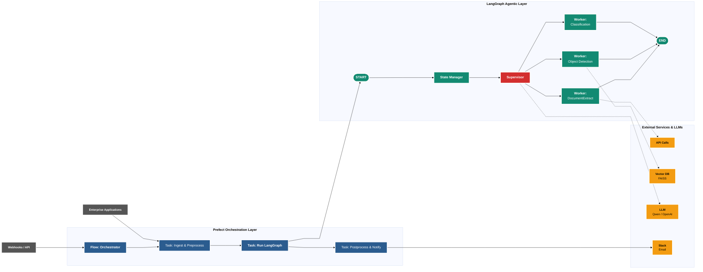

# Technical Architecture

## System Overview

This document describes the architecture of the LangGraph + Prefect orchestration system.

### Data Flow

## Component Descriptions

### Data Sources
- **Webhooks / API**: External event triggers
- **Enterprise Applications**: Data ingestion sources

### Prefect Orchestration Layer
- **Flow**: Main orchestrator managing the workflow
- **Task 1**: Data ingestion and preprocessing
- **Task 2**: Invokes LangGraph agents
- **Task 3**: Postprocessing and notifications

### LangGraph Agentic Layer
- **Supervisor**: Routes tasks to appropriate workers
- **Workers**: Execute specialized tasks (Document Extraction, Object Detection, Classification)
- **State Manager**: Maintains conversation and processing state

### External Services
- **Vector DB (FAISS)**: Semantic search and embeddings
- **LLM (Qwen/OpenAI)**: Language model inference
- **API Calls**: Third-party integrations
- **Notifications**: Slack/Email alerts
