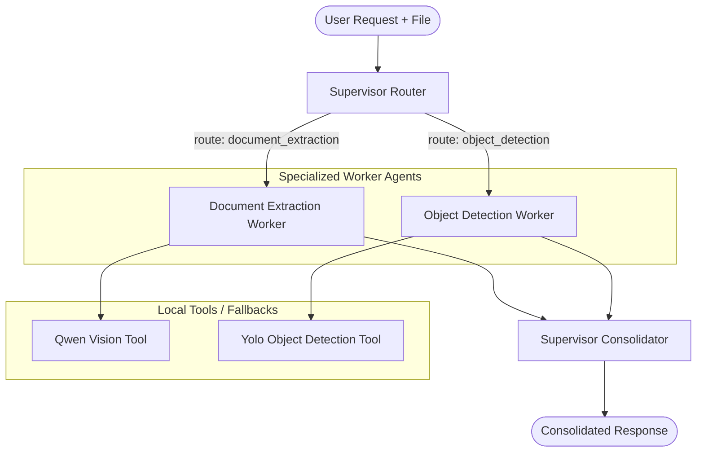
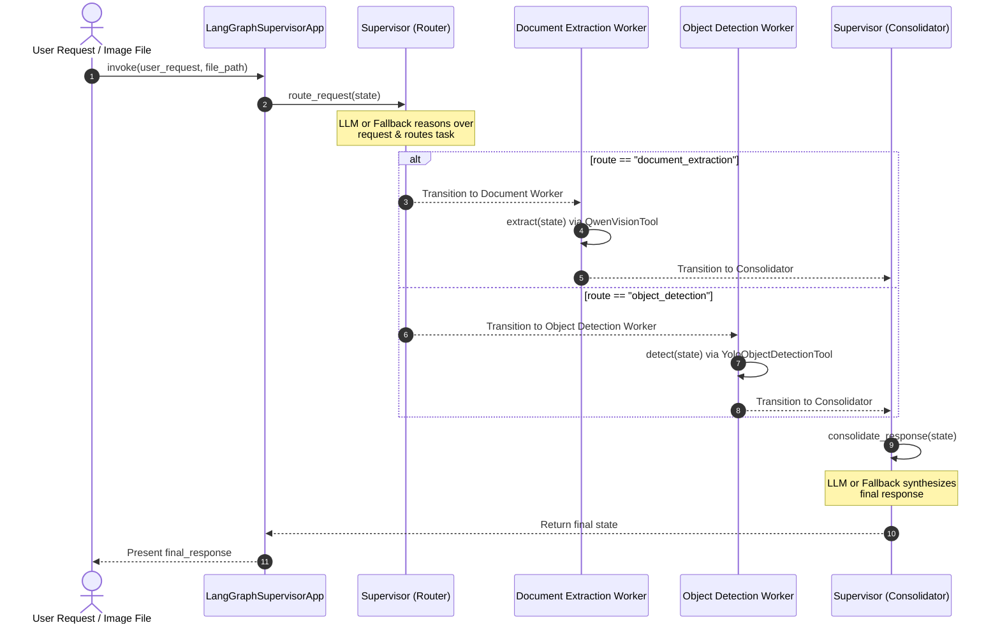

# LangGraph Supervisor/Worker Agent Application

A modular multi-agent system built using **LangGraph** and **Python**. The application features an intelligent **Supervisor Agent** that dynamically routes document and visual analysis queries to specialized **Worker Agents** (Document Extraction and Object Detection), then consolidates their findings into a unified, user-facing final response.

---

## 🎯 Project Objectives

- **Intelligent Routing**: Employ a centralized Supervisor Agent that reasons over user queries and file types to delegate tasks.
- **Specialized Workers**:
  - **Document Extraction Worker**: Parses text documents, PDFs, and images to extract layout and text content using local models (or fallback parsing).
  - **Object Detection Worker**: Detects and localizes visual items within images using a YOLO model with local fallback simulations.
- **Consolidated Synthesis**: Combine individual worker execution results back into a clear, cohesive final response.
- **Robust Execution**: Seamless execution in any environment by utilizing deterministic local tool fallbacks when external LLMs or large machine-learning libraries are not configured.

---

## 🏗️ Architecture Design

The application follows a directed routing and consolidation lifecycle designed with LangGraph. 

### 1. Conceptual Architecture Diagram



### 2. Request Lifecycle & Sequence Flow

The following sequence diagram outlines how data moves through the state graph:



---

## 📂 Project Directory Structure

```text
langgraph-qwen/
├── app/
│   ├── __init__.py
│   ├── agents.py       # Core Agent definitions, routing, consolidation, and Graph configuration
│   ├── demo.py         # Entry point script containing executable demo cases
│   ├── models.py       # Typing and AgentState schemas
│   └── tools.py        # Implementation of Qwen Vision and YOLO Object Detection tools
├── tests/
│   ├── test_agents.py  # Unit tests for routing, tools, workers, and full workflow
│   └── test_tools.py   # Unit tests for basic file processing tools
├── pyproject.toml      # Dependency specification (PEP 518)
├── requirements.txt    # Legacy python package requirements
├── README.md           # Project documentation
└── .env                # (Optional) Local configuration file for OpenAI integration
```

---

## 🔧 Component Details

### 1. Shared State Schema (`app/models.py`)
Maintains the execution state passed between nodes in the LangGraph workflow:
- `user_request`: The raw prompt from the user.
- `file_path`: Path to the image, PDF, or text file.
- `file_type`: Automatically resolved extension of the file.
- `extracted_text`: Populated by the Document Extraction worker.
- `detected_objects`: Structured detection boundaries and confidence list (`[{"class", "confidence", "box"}]`) populated by the Object Detection worker.
- `supervisor_plan`: Reasoning plan generated by the routing supervisor.
- `worker_result`: Raw findings text generated by the active worker.
- `final_response`: Consolidated answer presented to the user.

### 2. Analysis Tools (`app/tools.py`)
- **`QwenVisionTool`**: Simulates visual text extraction and processes standard PDF/text inputs locally.
- **`YoloObjectDetectionTool`**:
  - Lazily imports `ultralytics.YOLO` if installed, executing real-world object detection.
  - Automatically falls back to a high-fidelity simulated detector if the environment doesn't have `ultralytics` or GPU runtimes.

### 3. Agentic Layer (`app/agents.py`)
- **`SupervisorAgent`**: Implements `route_request` (determines active worker) and `consolidate_response` (synthesizes final answer). Uses OpenAI's LLM if `OPENAI_API_KEY` is present; falls back to deterministic rule-based logic otherwise.
- **`DocumentExtractionWorker`**: Invokes the document understanding pipeline.
- **`ObjectDetectionWorker`**: Invokes the object detection pipeline.
- **`LangGraphSupervisorApp`**: Compiles the graph and exposes a simple `.invoke(...)` interface.

---

## 🚀 Setup & Installation

### Prerequisites
- **Python**: `>=3.13`
- **uv**: Recommended fast package manager. If not installed, get it via:
  ```powershell
  powershell -ExecutionPolicy ByPass -c "irm https://astral.sh/uv/install.ps1 | iex"
  ```

### Installation Steps

1. Clone or navigate to the workspace:
   ```bash
   cd langgraph-qwen
   ```

2. Create a virtual environment and install dependencies:
   ```bash
   uv venv
   uv pip install -r pyproject.toml
   ```

---

## ⚙️ Configuration

Create a `.env` file in the root directory (or update environmental variables) to supply OpenAI API credentials:
```env
OPENAI_API_KEY=your-api-key-here
SUPERVISOR_MODEL=gpt-4o-mini
```
*Note: If no API key is specified, the application seamlessly activates deterministic routing and consolidation, ensuring full operational capability without cloud network dependencies.*

---

## 🏃 Execution Instructions

### Running the Demo Application
The demo executes both tasks sequentially (first a document extraction query, followed by an object detection task on `sample_document.png`):
```bash
uv run python -m app.demo
```

### Running Unit Tests
Execute the test suite verifying all code paths:
```bash
uv run python -m unittest discover -s tests
```

---

## 📝 Sample Usage Demonstration

When running the application with `uv run python -m app.demo`, the following consolidated response shows the agent reasoning lifecycle:

```text
============================================================
Supervisor/Worker LangGraph Demo: Object Detection
============================================================
Supervisor plan: The request is about identifying, locating, and listing objects within an image.

Consolidated Response:
I have analyzed the image "sample_document.png" and detected the following objects:

1. **Document** - Confidence: 0.95, located within the bounding box [10.0, 10.0, 490.0, 210.0].
2. **Text Block** - Confidence: 0.88, located within the bounding box [40.0, 50.0, 450.0, 150.0].

If you need further details or assistance, feel free to ask!
============================================================
```
